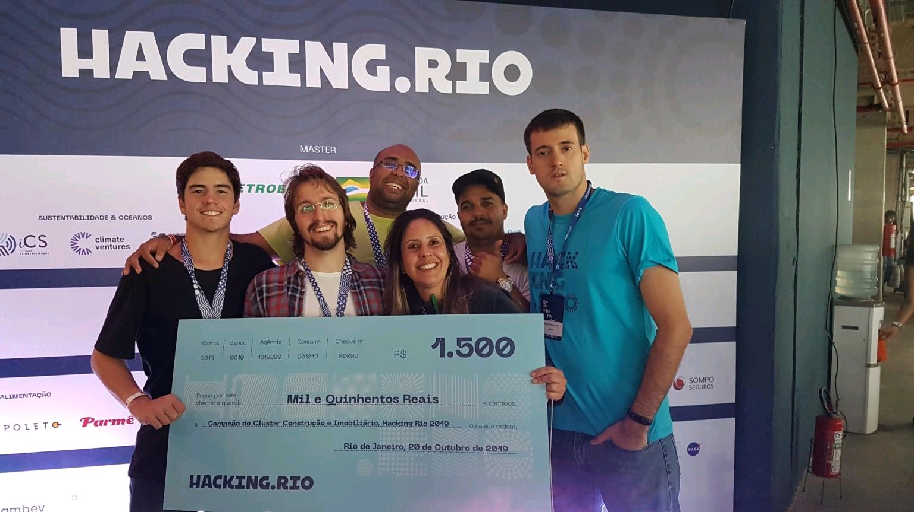
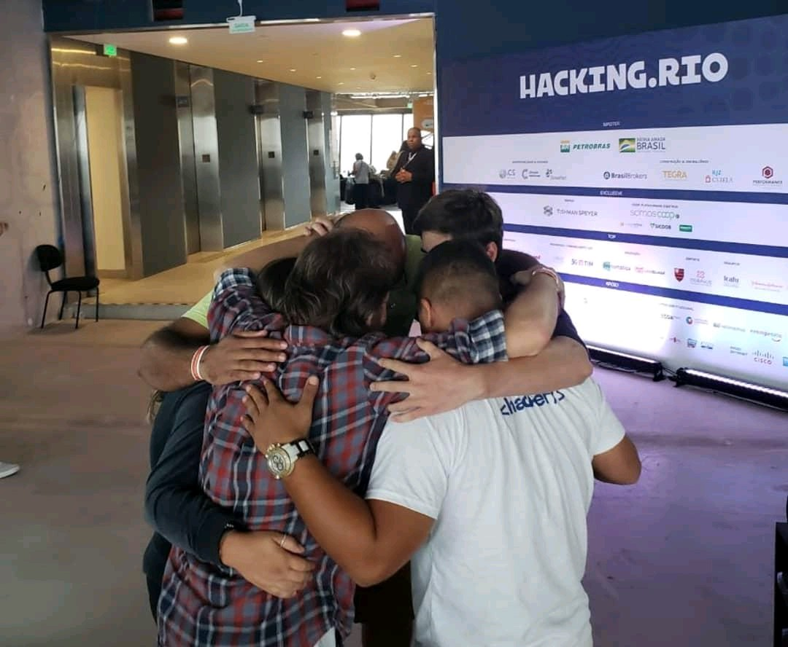

# 44 Soluções Financeiras

Registro histórico reconstruído do projeto vencedor do HackInRio 2019.

## Documento principal

- [Reconstrução histórica da 44 Soluções Financeiras](./2019-44-solucoes-financeiras-hackinrio-reconstruction.md)

## Registros fotográficos

### Premiação e medalha

O painel do evento registra, entre outros patrocinadores e apoiadores, a marca **Cyrela** no eixo relacionado a construção e imobiliário.

### Outros registros preservados

## Desdobramento posterior observado

Anos depois, os integrantes relacionaram a experiência da 44 ao avanço da Cyrela no mercado de crédito imobiliário digital por meio da **CashMe**.

- Site oficial: [CashMe — crédito e financiamento imobiliário](https://www.cashme.com.br/)

A CashMe já existia antes do HackInRio 2019. Este registro não afirma que ela tenha sido criada a partir da 44 nem que tenha implementado sua arquitetura completa. A relação é preservada como desdobramento observado pelos participantes: a equipe apresentou e negociou com a Cyrela uma proposta de arquitetura financeira imobiliária; a pandemia interrompeu a continuidade; posteriormente, uma empresa do grupo ampliou sua atuação pública nesse mesmo território econômico.

O ponto histórico não é acusar apropriação, especialmente porque, segundo a memória dos participantes, os termos do evento previam direitos compartilhados sobre a ideia. O ponto é registrar uma possível validação posterior da qualidade e da relevância do problema atacado pela 44.
